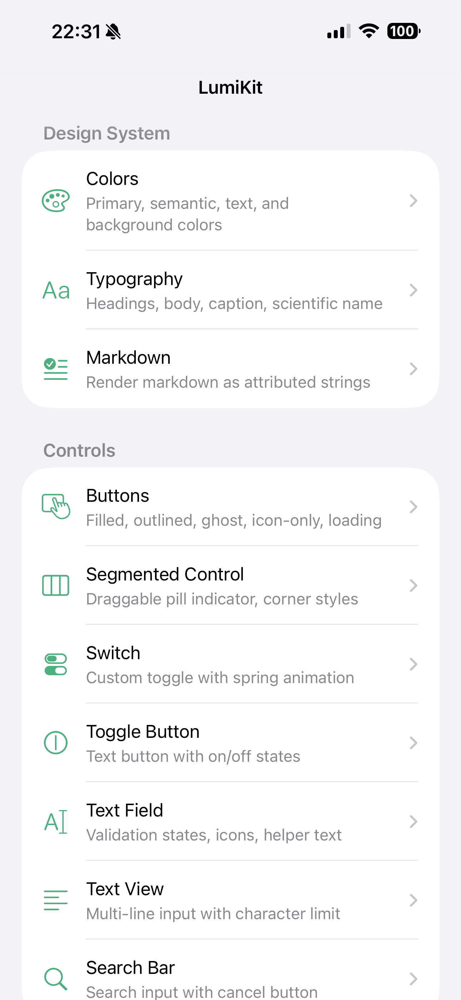
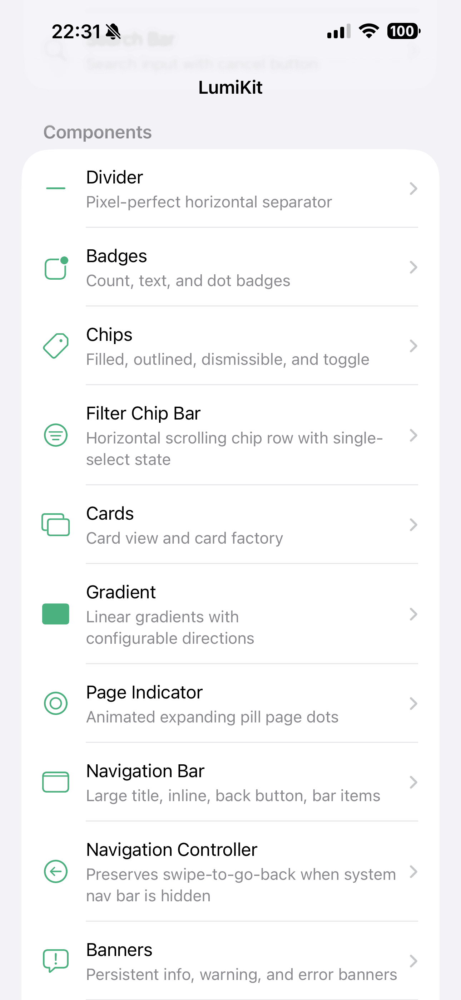
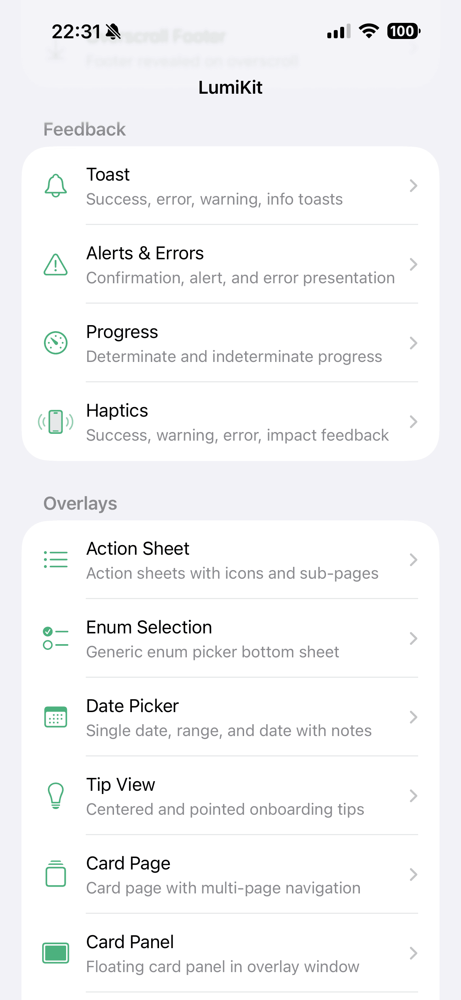
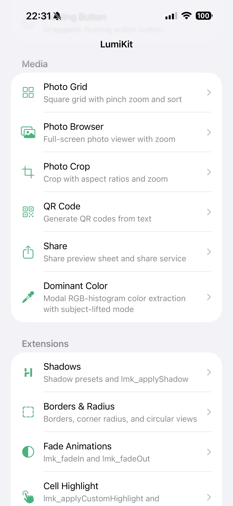
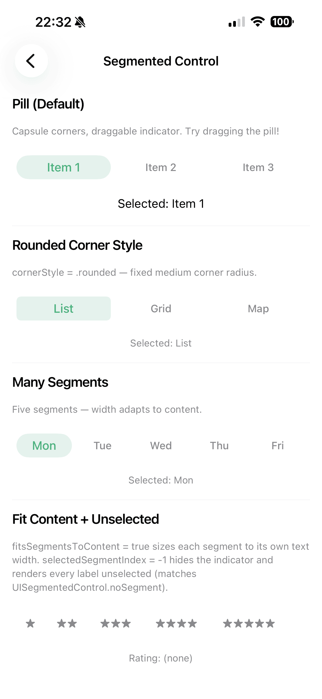
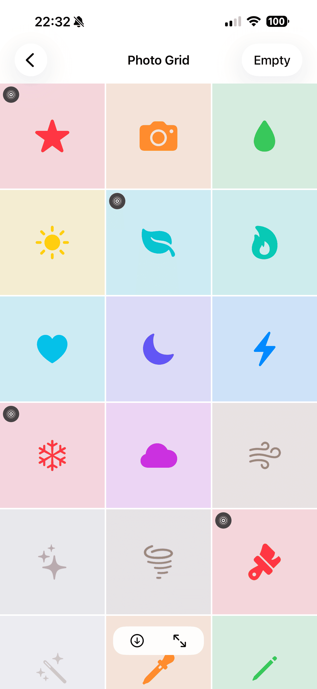
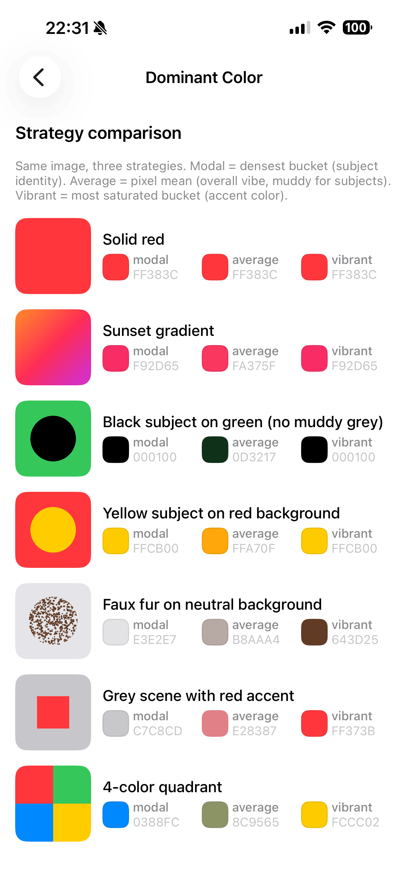

<p align="center">
  
</p>

# LumiKit

[](https://swiftpackageindex.com/Luminoid/LumiKit)
[](https://swiftpackageindex.com/Luminoid/LumiKit)
[](LICENSE)

Shared Swift Package providing **design tokens**, **UI components**, and **utilities** for Lumi apps. Built with Swift 6.2 strict concurrency, UIKit + SnapKit, and a fully configurable theming system.

---

## Table of Contents

1. [Overview](#overview)
2. [Screenshots](#screenshots)
3. [Requirements](#requirements)
4. [Installation](#installation)
5. [Quick Start](#quick-start)
6. [Package Structure](#package-structure)
7. [Design System](#design-system)
8. [Components](#components)
9. [Controls](#controls)
10. [Extensions](#extensions)
11. [Animation & Haptics](#animation--haptics)
12. [Core Utilities](#core-utilities)
13. [UI Utilities](#ui-utilities)
14. [Photo](#photo)
15. [Share](#share)
16. [QR Code](#qr-code)
17. [Error Handling](#error-handling)
18. [Debug Tools](#debug-tools-debug-builds-only)
19. [Build & Test](#build--test)
20. [Release](#release)
21. [Dependencies](#dependencies)
22. [Built with LumiKit](#built-with-lumikit)
23. [TODO](#todo)
24. [License](#license)
25. [Changelog](#changelog)

---

## Overview

LumiKit is organized into four targets so apps can import only what they need:

| Target | Dependencies | Purpose |
|--------|-------------|---------|
| **LumiKitCore** | Foundation only | Logger, date helpers, URL validation, format helpers, file utilities, concurrency helpers, collection/string extensions |
| **LumiKitNetwork** | LumiKitCore | Network debugging with URLProtocol interception (DEBUG only, Swift 6 concurrency compatible) |
| **LumiKitUI** | LumiKitCore + LumiKitNetwork + SnapKit | Design system tokens, theme manager, animation, haptics, alerts, components, controls, photo browser/crop, network debug UI (DEBUG), UIKit extensions |
| **LumiKitLottie** | LumiKitUI + Lottie | Lottie-powered pull-to-refresh control |

**122 source files** across 4 targets, with **1073 tests** across 4 test targets (at 0.12.0).

---

## Screenshots

From the Example app (`Example/LumiKitExample.xcodeproj`):

### Example app sections

| Design System & Controls | Components | Feedback & Overlays | Media & Extensions |
|---|---|---|---|
|  |  |  |  |

### Highlights

| Segmented Control | Photo Grid | Dominant Color |
|---|---|---|
|  |  |  |

---

## Requirements

- Swift 6.2+
- iOS 18+ / Mac Catalyst 18+ / macOS 15+
- Xcode 26+

---

## Installation

Add LumiKit to your project via Swift Package Manager:

```swift
dependencies: [
    .package(path: "../LumiKit")  // Local package
    // or
    .package(url: "https://github.com/Luminoid/LumiKit.git", from: "0.12.0")
]
```

Then add the targets you need:

```swift
.target(
    name: "MyApp",
    dependencies: [
        "LumiKitCore",    // Foundation utilities only
        "LumiKitNetwork", // Optional: Network debugging (DEBUG only)
        "LumiKitUI",      // Full design system + components (includes Network)
        "LumiKitLottie",  // Optional: Lottie pull-to-refresh
    ]
)
```

**Note**: `LumiKitUI` automatically includes `LumiKitNetwork`, so you only need to import `LumiKitNetwork` explicitly if using it without UI components.

---

## Quick Start

```swift
import LumiKitUI

// 1. Configure the theme at app launch
LMKThemeManager.shared.configure(
    colors: MyAppTheme(),
    typography: .init(fontFamily: "Inter"),
    spacing: .init(large: 20, xxl: 28),
    cornerRadius: .init(small: 12, medium: 16)
)

// 2. Use design tokens throughout your app
let label = LMKLabelFactory.heading(text: "Hello")
view.backgroundColor = LMKColor.backgroundPrimary

// 3. Use components
LMKToast.showSuccess(message: "Saved!", on: self)

let emptyState = LMKEmptyStateView()
emptyState.configure(message: "Nothing here yet", icon: "tray", style: .card)
```

---

## Example App

The `Example/` directory contains a full catalog app demonstrating every component. It uses [XcodeGen](https://github.com/yonaskolb/XcodeGen) to generate the Xcode project:

```bash
cd Example
xcodegen generate
open LumiKitExample.xcodeproj
```

The example includes **51 interactive pages** across 9 sections:

- **Design System**: Colors, Typography, Markdown
- **Controls**: Buttons, Toggle Button, Switch, Segmented Control, Slider, Text Field, Text View, Search Bar
- **Components**: Divider, Gradient, Badges, Chips, Filter Chip Bar, Cards, Banners, Empty State, Loading State
- **Lists & Cells**: Checkbox Cell, Icon List Row, Cell Highlight, Overscroll Footer
- **Navigation & Paging**: Navigation Bar, Navigation Controller, Page Indicator, Segmented Pages
- **Feedback**: Toast, Alerts & Errors, Progress, Haptics
- **Overlays**: Action Sheet, Enum Selection, Date Picker, Tip View, Card Page, Card Panel, Floating Button
- **Media**: Photo Grid, Photo Browser, Photo Crop, Pick & Crop, Share, QR Code, Dominant Color
- **Extensions**: UIColor, Shadows, Borders & Radius, Fade Animations, Keyboard Dismiss

---

## Package Structure

```
LumiKit/
├── Package.swift
├── Sources/
│   ├── LumiKitCore/
│   │   ├── Concurrency/       # LMKConcurrencyHelpers (encode/decode off main)
│   │   ├── Data/              # LMKFormatHelper, Collection+LMK,
│   │   │                      # NSAttributedString+LMK, String+LMK
│   │   ├── Date/              # LMKDateHelper, LMKDateFormatterHelper
│   │   ├── File/              # LMKFileUtil
│   │   ├── Log/               # LMKLogger, LMKLogStore (ring buffer),
│   │   │                      # LMKLogLevel, LMKLogEntry
│   │   └── Validation/        # LMKURLValidator
│   ├── LumiKitNetwork/        # [DEBUG only, isolated concurrency workarounds]
│   │   ├── LMKNetworkLogger.swift            # URLProtocol-based interception
│   │   ├── LMKNetworkRequestStore.swift       # Thread-safe ring buffer
│   │   ├── LMKNetworkRequestRecord.swift      # Request/response data
│   │   └── URLSessionConfiguration+LMKDebug.swift  # .enableNetworkLogging()
│   ├── LumiKitUI/
│   │   ├── Alerts/            # LMKAlertPresenter, LMKErrorHandler, LMKCountdownConfirmation
│   │   ├── Animation/         # LMKAnimationHelper
│   │   ├── Components/
│   │   │   ├── BottomSheet/   # LMKBottomSheetController (base), LMKActionSheet,
│   │   │   │                  # LMKEnumSelectionBottomSheet, LMKBottomSheetLayout
│   │   │   ├── Pickers/       # LMKDatePickerHelper
│   │   │   ├── LMKBadgeView, LMKBannerView, LMKCardView, LMKChipView,
│   │   │   ├── LMKDividerView, LMKEmptyStateView, LMKFilterChipBar,
│   │   │   ├── LMKFloatingButton,
│   │   │   ├── LMKGradientView, LMKLoadingStateView, LMKNavigationBar,
│   │   │   ├── LMKNavigationController, LMKPageIndicator,
│   │   │   ├── LMKProgressViewController, LMKSearchBar,
│   │   │   ├── LMKSkeletonCell, LMKToastView, LMKTipView,
│   │   │   ├── LMKCardPageController, LMKCardPageLayout,
│   │   │   ├── LMKCardPanelController, LMKCardPanelLayout,
│   │   │   ├── LMKNavigationDirection, LMKOverscrollFooterHelper,
│   │   │   └── LMKFormScaffold, LMKScrollStackViewController
│   │   ├── Controls/          # LMKButton, LMKSegmentedControl, LMKSwitch,
│   │   │                      # LMKToggleButton, LMKTextField, LMKTextView
│   │   ├── DesignSystem/
│   │   │   ├── Tokens/        # LMKColor, LMKSpacing, LMKCornerRadius, LMKAlpha,
│   │   │   │                  # LMKLayout, LMKShadow, LMKTypography, LMKBadge
│   │   │   ├── Themes/        # LMKSpacingTheme, LMKCornerRadiusTheme, LMKAlphaTheme,
│   │   │   │                  # LMKLayoutTheme, LMKShadowTheme, LMKTypographyTheme,
│   │   │   │                  # LMKBadgeTheme, LMKAnimationTheme
│   │   │   ├── Factories/     # LMKButtonFactory, LMKCardFactory, LMKLabelFactory
│   │   │   └── LMKTheme.swift # LMKTheme protocol + LMKThemeManager + LMKDefaultTheme
│   │   ├── Debug/             # [DEBUG only]
│   │   │   └── Network/       # LMKNetworkHistoryViewController, LMKNetworkDetailViewController
│   │   ├── Extensions/        # UIKit extensions (lmk_ prefix)
│   │   ├── Haptics/           # LMKHapticFeedbackHelper
│   │   ├── Photo/             # LMKPhotoBrowserViewController, LMKPhotoBrowserCell,
│   │   │                      # LMKPhotoCropViewController, LMKPhotoGridViewController,
│   │   │                      # LMKPhotoGridCell, LMKPhotoEXIFService, LMKPhotoBrowserConfig,
│   │   │                      # LMKPhotoPickCropCoordinator, LMKSinglePhotoViewer
│   │   ├── QRCode/            # LMKQRCodeGenerator
│   │   ├── Share/             # LMKShareService, LMKSharePreviewViewController
│   │   └── Utilities/         # LMKDeviceHelper, LMKKeyboardObserver, LMKKeyboardInsetHelper,
│   │                          # LMKKeyboardAdjustment, LMKSceneUtil, LMKImageUtil,
│   │                          # LMKDominantColorExtractor, LMKMarkdownRenderer,
│   │                          # LMKPointerStyle
│   └── LumiKitLottie/         # LMKLottieRefreshControl
├── Tests/
│   ├── LumiKitCoreTests/      # 76 tests, 12 suites — mirrors LumiKitCore/ subfolders
│   │   ├── Concurrency/       # LMKConcurrencyHelpers
│   │   ├── Data/              # String+LMK, Collection+LMK, NSAttributedString+LMK, FormatHelper
│   │   ├── Date/              # DateHelper, DateFormatterHelper
│   │   ├── File/              # FileUtil
│   │   ├── Log/               # LMKLogStore (ring buffer, thread safety),
│   │   │                      # LMKLogger (log store integration)
│   │   └── Validation/        # URLValidator
│   ├── LumiKitNetworkTests/   # 65 tests, 4 suites
│   │   ├── LMKNetworkRequestStoreTests.swift         # FIFO, thread safety
│   │   ├── LMKNetworkRequestRecordTests.swift        # Computed properties, display formatting
│   │   ├── LMKNetworkLoggerTests.swift               # Configuration, state transitions
│   │   └── URLSessionConfigurationLMKDebugTests.swift # enableNetworkLogging
│   ├── LumiKitUITests/        # 922 tests, 130 suites
│   │   ├── Alerts/            # AlertPresenter, ErrorHandler
│   │   ├── Animation/         # AnimationHelper
│   │   ├── Components/
│   │   │   ├── BottomSheet/   # BottomSheetController, ActionSheet, BottomSheetLayout,
│   │   │   │                  # EnumSelectionBottomSheet
│   │   │   ├── Pickers/       # DatePickerHelper
│   │   │   ├── Badge, Banner, Card, CheckboxCell, Chip, Divider, EmptyState,
│   │   │   ├── Gradient, LoadingState, SearchBar, Skeleton, Toast,
│   │   │   ├── FloatingButton, TipView, CardPage, CardPanel,
│   │   │   └── Progress, FormScaffold, ScrollStackViewController
│   │   ├── Controls/          # Button, SegmentedControl, TextField, TextView, ToggleButton
│   │   ├── DesignSystem/
│   │   │   ├── Tokens/        # Color, Spacing, CornerRadius, Alpha, Typography, Layout, Shadow
│   │   │   ├── Themes/        # AnimationTheme, BadgeTheme, SendableCompliance
│   │   │   ├── Factories/     # ButtonFactory, CardFactory, LabelFactory
│   │   │   └── ThemeManager, ComponentToken integration
│   │   ├── Extensions/        # UIColor, UIImage, UIStackView,
│   │   │                      # UIView (shadow/border/fade/layout),
│   │   │                      # UIViewController (TopViewController, KeyboardDismiss),
│   │   │                      # UITableViewCell (IconListRow), UITextField (KeyboardDismiss)
│   │   ├── Photo/             # CropAspectRatio, PhotoEXIF,
│   │   │                      # PhotoPickCropCoordinator, SinglePhotoViewer
│   │   ├── QRCode/            # QRCodeGenerator
│   │   ├── Share/             # SharePreview, ShareService
│   │   └── Utilities/         # DeviceHelper, ImageUtil, KeyboardObserver,
│   │                          # KeyboardInsetHelper, KeyboardAdjustment, MarkdownRenderer,
│   │                          # PointerStyle
│   └── LumiKitLottieTests/    # 7 tests, 1 suite
│       └── LMKLottieRefreshControlTests.swift
```

---

## Design System

All design tokens are fully configurable via `LMKThemeManager`. Each category has a configuration struct with sensible defaults. Token enums proxy to the active configuration at runtime.

### Token Categories

| Category | Token Enum | Config Struct | Examples |
|----------|-----------|---------------|----------|
| Colors | `LMKColor` | `LMKTheme` (protocol) | `.primary`, `.backgroundPrimary`, `.textPrimary` |
| Typography | `LMKTypography` | `LMKTypographyTheme` | `fontFamily`, `h1Size`, `bodySize`, line heights |
| Spacing | `LMKSpacing` | `LMKSpacingTheme` | `.xs` (4pt), `.small` (8pt), `.medium` (12pt), `.large` (16pt) |
| Corner Radius | `LMKCornerRadius` | `LMKCornerRadiusTheme` | `.small` (8), `.medium` (12), `.large` (16) |
| Alpha | `LMKAlpha` | `LMKAlphaTheme` | `.overlay`, `.disabled`, `.overlayStrong` |
| Layout | `LMKLayout` | `LMKLayoutTheme` | `.minimumTouchTarget` (44), `.iconMedium` (24), `.hairline` / `hairline(forScale:)` (one physical pixel; not themeable — display physics, not branding) |
| Shadow | `LMKShadow` | `LMKShadowTheme` | `small()`, `button()`, `cellCard()`, `card()`, `medium()`, `large()` |
| Animation | `LMKAnimationHelper` | `LMKAnimationTheme` | `.Duration.*`, `.Spring.damping`, `.shouldAnimate`, `.shimmer` |
| Badge | `LMKBadgeView` | `LMKBadgeTheme` | `minWidth`, `height`, `horizontalPadding` |

### Configuration

```swift
// Configure everything at once
LMKThemeManager.shared.configure(
    colors: MyAppTheme(),
    typography: .init(fontFamily: "Inter"),
    spacing: .init(large: 20, xxl: 28),
    cornerRadius: .init(small: 12, medium: 16)
)

// Or configure individual categories
LMKThemeManager.shared.apply(MyAppTheme())
LMKThemeManager.shared.apply(typography: .init(fontFamily: "Inter"))
LMKThemeManager.shared.apply(spacing: .init(large: 20))
```

### Architecture: Token Enum → Config Struct → ThemeManager

```swift
// 1. Config struct with defaults (nonisolated, Sendable — safe from any context)
public nonisolated struct LMKSpacingTheme: Sendable {
    public var large: CGFloat
    public init(large: CGFloat = 16, ...) { ... }
}

// 2. Token enum proxies to active config (@MainActor)
public enum LMKSpacing {
    private static var config: LMKSpacingTheme { LMKThemeManager.shared.spacing }
    public static var large: CGFloat { config.large }
}

// 3. ThemeManager holds the active config
LMKThemeManager.shared.apply(spacing: .init(large: 20))
```

### Factories

| Factory | Purpose |
|---------|---------|
| `LMKButtonFactory` | Role-based button factory — `filled(role:)`, `outlined(role:)`, `ghost(role:)`, and `iconOnly(role:)` with `LMKButtonRole` (primary, secondary, destructive, warning, success, info) |
| `LMKCardFactory` | Card views with shadow and corner radius |
| `LMKLabelFactory` | Styled labels (title, subtitle, body, caption) |

---

## Components

| Component | Purpose |
|-----------|---------|
| `LMKBottomSheetController` | Base class for bottom sheet presentation with shared dimming, container, velocity-aware drag-to-dismiss, and unified animation. `avoidsKeyboard` (default `true`) lifts the sheet by the keyboard's actual overlap with its view via `containerBottomConstraint`, animated with the keyboard's curve/duration and restored on hide; while enabled the controller owns the keyboard offset (subclasses must not also drive it — override to `false` for manual control) |
| `LMKActionSheet` | Custom bottom-sheet action sheet with design-token styling, optional custom content, `isSelected` checkmark state, and sub-page navigation |
| `LMKBadgeView` | Notification count, status dot, or custom text badge |
| `LMKBannerView` | Persistent notification bar with optional action and dismiss |
| `LMKCardView` | Card container with shadow, corner radius, content insets |
| `LMKChipView` | Tag/filter chip (`.filled` / `.outlined`) with optional tap handler |
| `LMKFilterChipBar` | Horizontal scrolling chip row built on `LMKChipView`. Single-select by default: optional "All" chip clears the filter, `selectionChangedHandler` fires with the filter index or `nil` for "All" / no selection. `allowsMultipleSelection` switches to additive toggling reported through `multiSelectionChangedHandler` as a `Set<Int>` (empty set allowed; the "All" chip clears it). `filterIcons` adds optional leading icons, positionally matched to titles (nil/missing entries render text-only; the "All" chip never carries an icon) |
| `LMKDividerView` | Pixel-perfect separator (horizontal / vertical) |
| `LMKEmptyStateView` | Empty state with icon, message, and optional action button (`Action`: title, optional leading SF Symbol, `LMKButton.Style`, handler) rendered below the message for `.fullScreen` / `.card`; `.inline` ignores it. `setAction(_:)` adds/replaces/removes post-configure. Content-driven height (icon → message → button constraint chain, no overlap at any type size); with an action present the view exposes message and button as separate accessibility elements |
| `LMKEnumSelectionBottomSheet` | Bottom sheet for selecting from an enum's cases — single-select (`present`) or multi-select with explicit Done button (`presentMultiSelect`) |
| `LMKGradientView` | `CAGradientLayer`-backed view with 4 direction options |
| `LMKLoadingStateView` | Loading indicator with optional message |
| `LMKNavigationBar` | Custom navigation bar with large title and standard inline modes, configurable bar items, back button, and design-token styling. `setLeftItemEnabled(at:_:)` / `setRightItemEnabled(at:_:)` toggle per-item enabled state. `setRightAccessoryView(_:)` parks a non-tappable view (sync indicator, status icon) to the left of the right items; `setLargeTitleAccessoryView(_:)` hangs an accessory off the trailing edge of the large title text (iOS Mail / Notes pattern). Bar buttons enable pointer hover feedback on iPad / Mac Catalyst |
| `LMKNavigationController` | `UINavigationController` subclass that preserves the edge-swipe-to-go-back gesture when the system nav bar is hidden. Pairs with `LMKNavigationBar`-based apps |
| `LMKProgressViewController` | Blocking progress modal (`.determinate` with progress bar, `.indeterminate` spinner-only) |
| `LMKSearchBar` | Search bar with configurable placeholder and cancel text |
| `LMKSkeletonCell` | Skeleton loading placeholder cell |
| `LMKCheckboxCell` | Check-off row for to-dos and checklists: checkbox + strike-through title, `configure(title:isDone:)`, `onToggle` callback. Checkbox hit area expands to the minimum touch target; done state is exposed via `accessibilityValue` and the `.selected` trait |
| `LMKDatePickerHelper` | Date picker presentation via `LMKActionSheet` — single date, date range, single-calendar range selection (`presentCalendarRangePicker`, tap to set start / end on one `UICalendarView`), date with text field |
| `LMKToastView` | Auto-dismissing toast notification |
| `LMKTipView` | Onboarding tip with centered or pointed (arrow) styles — tap to dismiss. Pointed style supports `sourceOffset` for fine-tuning position |
| `LMKFloatingButton` | Draggable floating action button with edge snapping and optional badge |
| `LMKCardPageController` | Base class for card-embedded navigation pages with header, title, and multi-page slide navigation |
| `LMKCardPanelController` | Centered floating card panel in its own overlay window, with shadow and slide animation |
| `LMKCardPageLayout` | Shared layout constants for card page controllers (header height, symbol sizes) |
| `LMKCardPanelLayout` | Shared layout constants for card panel controllers (max width, insets, height ratio) |
| `LMKScrollStackViewController` | Base class for scrollable vertical stack layout — configurable spacing, insets, keyboard dismiss, safe area. Subclasses override `setupStackContent()`. Optional `navigationBar: LMKNavigationBar?` pins a custom bar above the scroll view (scroll view tops out at the bar's bottom); `installsKeyboardAdjustment` (default `true`) installs scroll-view keyboard avoidance |
| `LMKFormScaffold` | Static builders for form screens outside the `LMKScrollStackViewController` hierarchy: `makeScrollView(keyboardDismissMode:)` (default `.onDrag`, keyboard avoidance pre-installed), `makeContentStack(spacing:)`, `install(scrollView:stack:in:below:contentInsets:)` pinning the pair below an optional top anchor view with token insets |
| `LMKSegmentedPageController` | Base class for a segmented tab container that pages between child view controllers with an interactive finger-tracking pan. Subclasses override `makePages()`, `usesFullWidthSwipe(forPageAt:)`, and `didChangePage(to:)`; `setPage(_:animated:)` slides for taps and deep links |
| `LMKNavigationDirection` | Shared navigation direction enum (`.forward`, `.backward`, `.none`) used by CardPageController and ActionSheet |
| `LMKPageIndicator` | Custom page indicator replacing `UIPageControl`. Active dot expands into pill shape with spring animation. `numberOfPages`, `currentPage`, `pageChangedHandler`. Display-only while `pageChangedHandler` is nil (taps / VoiceOver adjustments ignored) |
| `LMKOverscrollFooterHelper` | Positions a footer view below scroll content, revealed only on overscroll |

---

## Controls

| Control | Purpose |
|---------|---------|
| `LMKButton` | Configurable button with tap handler, pill shape, and 4 styles: `.filled`, `.outlined`, `.ghost` (text-only), `.iconOnly` (circular icon). Supports `isLoading` state; pointer hover feedback on iPad / Mac Catalyst |
| `LMKSegmentedControl` | Custom segmented control with sliding pill indicator, spring animation, and haptic feedback. Not a `UISegmentedControl` subclass. `fitsSegmentsToContent` (per-segment natural width) composes with `makeScrollableContainer()`; `itemPadding` / `itemSpacing` tune per-segment padding and inter-segment gap for scrollable tag/filter bars |
| `LMKSlider` | Tokenized continuous or step-snapped slider with optional caption + live value readout row above the track. `step > 0` snaps to `minimumValue + n * step` (cached snapped value bypasses `UISlider`'s float drift). `valueFormatter` drives the readout; both caption and readout auto-hide when nil. User drags fire `.valueChanged` + `valueChangedHandler`; programmatic `value` / `setValue(_:animated:)` are silent |
| `LMKSwitch` | Custom toggle switch replacing `UISwitch`. Rounded track with sliding thumb, spring animation, haptic feedback. `isOn`, `setOn(_:animated:)`, `valueChangedHandler` |
| `LMKTextField` | Text field with validation states, helper text, leading icon |
| `LMKTextView` | Multi-line text input with placeholder and character limit |
| `LMKToggleButton` | Toggle button with on/off states |

---

## Extensions

All UIKit extensions use the `lmk_` prefix to avoid naming conflicts.

| Extension | Key Methods |
|-----------|-------------|
| `UIColor+LMK` | `init(lmk_hex:)`, `lmk_dynamic(lightHex:darkHex:alpha:)`, `lmk_hexString`, `lmk_isLight`, `lmk_adjustedBrightness(by:)`, `lmk_contrastingTextColor` |
| `UIImage+LMK` | `lmk_resized(maxDimension:)`, `lmk_resized(to:)`, `lmk_solidColor(_:size:)`, `lmk_rounded(cornerRadius:)` |
| `UIView+LMKShadow` | `lmk_applyShadow(_:)`, `lmk_removeShadow()` |
| `UIView+LMKBorder` | `lmk_applyBorder(...)` (width defaults to `LMKLayout.hairline` — one physical pixel), `lmk_removeBorder()`, `lmk_applyCornerRadius(_:)`, `lmk_makeCircular()` |
| `UIView+LMKFade` | `lmk_fadeIn(...)`, `lmk_fadeOut(...)` |
| `UIView+LMKLayout` | `lmk_safeAreaSnp`, `lmk_setEdgesEqualToSuperview()`, `lmk_centerInSuperview()`, `lmk_setAutoLayoutSize(width:height:)` |
| `UIStackView+LMK` | `init(lmk_axis:...)`, `lmk_addArrangedSubviews(_:)`, `lmk_removeAllArrangedSubviews()` |
| `UIButton+LMKAnimation` | Tap animation helpers |
| `UIControl+LMKTouchArea` | Expanded touch area support |
| `UITableViewCell+LMKHighlight` | Custom highlight behavior |
| `UITableViewCell+LMKIconListRow` | `lmk_configureIconListRow(iconSystemName:title:subtitle:tint:pointerEnabled:)` — standard detail-list row with an SF Symbol in a tinted circle (`LMKLayout.iconCircle`), disclosure, and the LumiKit highlight. `pointerEnabled` (default `true`) installs a hover `UIPointerInteraction` once per cell, routed through `LMKPointerStyle` |
| `UITextField+LMKFormStyle` | Form-styled text field configuration |
| `UITextField+LMKKeyboardDismiss` | `lmk_dismissKeyboardOnReturn()` — Done return key + resign on `.editingDidEndOnExit` (also on `LMKTextField`) |
| `UIViewController+LMKKeyboardDismiss` | `lmk_dismissKeyboardOnTap()` — tap anywhere outside a field dismisses the keyboard without swallowing control taps |
| `UIViewController+LMKOrientation` | Orientation lock helpers |
| `UIViewController+LMKPopover` | Popover presentation helpers |
| `UIViewController+LMKTopViewController` | Top view controller traversal |

---

## Animation & Haptics

| Utility | Purpose |
|---------|---------|
| `LMKAnimationHelper` | Centralized animation timing with Reduce Motion support (`shouldAnimate`), spring damping, and duration presets. Button-press spring animation (`animateButtonPressDown/Up/Press`) accepts any `UIControl`, so custom controls can reuse it |
| `LMKAnimationTheme` | Configurable animation token struct (durations including `shimmer` for skeleton loading, spring parameters) via `LMKThemeManager` |
| `LMKHapticFeedbackHelper` | Haptic feedback helpers — light, medium, heavy, soft, rigid impact and success/error notification feedback |

---

## Core Utilities

LumiKitCore provides Foundation-only utilities with zero dependencies:

| Utility | Purpose |
|---------|---------|
| `LMKLogger` | Structured logging with categories (`.general`, `.data`, `.ui`, `.network`, `.error`) and opt-in in-memory log store (`LMKLogStore`) |
| `LMKDateHelper` | Date calculation, comparison, and formatting helpers |
| `LMKDateFormatterHelper` | Cached date formatters for performance |
| `LMKFormatHelper` | Number and string formatting utilities |
| `LMKFileUtil` | File system operations |
| `LMKURLValidator` | URL validation and sanitization |
| `LMKConcurrencyHelpers` | Off-main-thread Codable encode/decode |
| `Collection+LMK` | Safe subscript, grouping, and collection utilities |
| `String+LMK` | String manipulation and validation extensions |
| `NSAttributedString+LMK` | Attributed string building helpers |

---

## UI Utilities

LumiKitUI includes device-aware helpers and system observers:

| Utility | Purpose |
|---------|---------|
| `LMKDeviceHelper` | Device type detection (`.iPhone`, `.iPad`, `.macCatalyst`), screen size classification, notch detection |
| `LMKKeyboardObserver` | Keyboard show/hide observer with height, end frame (`frameEnd`, for overlap math against a local view), and animation duration info |
| `LMKKeyboardAdjustment` | One-call keyboard avoidance: `scrollView.lmk_enableKeyboardAdjustment()` installs an associated-object adjuster that grows the bottom content and scroll indicator insets to the keyboard overlap and scrolls the focused field into view; restores on hide. No-op on Mac Catalyst |
| `LMKImageUtil` | SF Symbol creation (`makeSymbolImage` with background), `CVPixelBuffer` to JPEG conversion, `encodeJPEG(_:maxDimension:quality:)` — nonisolated downsample + opaque RGBX re-render so encodes stay 3-channel (avoids ImageIO's "AlphaPremulLast" double-memory path) and EXIF orientation is baked in |
| `LMKDominantColorExtractor` | RGB-histogram dominant color extraction. `dominantColor(from:ignoringTransparent:strategy:)` returns one color: `.modal` (default, densest bucket = subject identity), `.average` (mean = overall vibe), `.vibrant` (most saturated = accent color). `dominantColors(from:count:ignoringTransparent:)` returns a top-N palette ordered by frequency. Pass a subject-lifted PNG with `ignoringTransparent: true` for hard-edge accuracy |
| `LMKMarkdownRenderer` | Markdown-to-attributed-string rendering: `render()` for inline (bold/italic), `renderFull()` for long-form content (headings, lists, fenced code blocks, GFM tables, line breaks preserved). Code and tables render in a monospaced font so AI chat responses stay readable |
| `LMKPointerStyle` | Window-safe `UIPointerStyle` factories for `UIPointerInteractionDelegate`: `automatic(for:)`, `highlight(for:)`, `lift(for:)`, `hover(for:...)`, plus the underlying `preview(for:)`. Each takes an optional view and returns `nil` unless it is non-nil **and** in a window, so the result is returned straight from the delegate. Raw `UITargetedPreview(view:)` aborts the process when its view has no window, and `interaction.view != nil` does not catch it (a recycled cell keeps the interaction) |
| `LMKSceneUtil` | Key window and connected scene retrieval |

---

## Photo

| Component | Purpose |
|-----------|---------|
| `LMKPhotoBrowserViewController` | Full-screen photo browser with zoom, swipe navigation, and optional Live Photo playback (`PHLivePhotoView` swaps in when the data source returns a paired `PHLivePhoto` — long-press to play, with a `livephoto` + "LIVE" indicator under the action button that fades during playback). Images load through the async `photo(at:)` requirement: pages show a placeholder, install through the standard sizing path, and drop generation-stale results. `showsActionButton = false` (set before presenting) hides the "…" action button for view-only hosts, and `actionButtonSystemImageName` swaps its SF Symbol (default `"ellipsis"`, e.g. `"trash"` when the sole action is destructive). The date/subtitle pill hides when the current photo has neither, and a single-photo browser shows no counter or page dots |
| `LMKPhotoCropViewController` | Photo cropping with aspect ratio support |
| `LMKPhotoPickCropCoordinator` | Pick → square-crop → store flow for a single photo using a permission-free `PHPicker`. Storage is injected as a `(UIImage) -> String?` closure; retain the coordinator for the flow's duration. `croppingEnabled: false` skips the crop editor and stores the pick as-is (receipts, documents) |
| `LMKSinglePhotoViewer` | Presents one image full-screen in `LMKPhotoBrowserViewController`; optional subtitle and action-button callback (the browser's "…" button is hidden when the callback is nil), plus `actionIconSystemName` to swap the button's symbol. Retain while the browser is up |
| `LMKPhotoGridViewController` | Photo grid with pinch-to-zoom column control, sort by date, content mode toggle, photo browser integration, and a LIVE badge on Live Photo cells. Cell images load through the async `photoGridImage(at:)` requirement: cells show a neutral placeholder immediately and apply results via a per-cell generation token, so stale loads never land on recycled cells. `browserShowsActionButton` forwards to the presented browser's `showsActionButton` |
| `LMKPhotoEXIFService` | Date and GPS extraction from UIImage or PHPickerResult. Date lookup walks EXIF (`DateTimeOriginal` / `DateTimeDigitized`), TIFF (`DateTime`), IPTC (`DateCreated` + `TimeCreated`, `DigitalCreationDate` + `DigitalCreationTime`), and the XMP packet (`xmp:CreateDate`, `xmp:DateCreated`, `xmp:ModifyDate`, `photoshop:DateCreated`) — surfaces a date for screenshots and edited / re-encoded photos where one container has been stripped |

Both photo view controllers force dark mode (`overrideUserInterfaceStyle = .dark`) and set `preferredStatusBarStyle = .lightContent`. They handle `modalPresentationCapturesStatusBarAppearance` automatically, so the status bar is correct when presented modally. If you embed them in a `UINavigationController`, override `childForStatusBarStyle` on the nav controller to return `topViewController`.

**Async image loading**: the image requirements — `photoGridImage(at:)` and `photo(at:)` — are `async` and called on the main actor. Implementations that decode or fetch should hop off the main actor themselves (e.g. `Task.detached` + `UIImage.preparingForDisplay()`) and return a ready-to-display image; a source that already holds a decoded image just returns it. Both hosts show a placeholder while loading and discard results that arrive after the cell was reused (monotonic generation token — cancellation alone can't guarantee that).

**Live Photo support** is opt-in via two optional data source methods (both default to no-op):

```swift
// LMKPhotoGridDataSource
func photoGridIsLivePhoto(at index: Int) -> Bool             // drives LIVE badge
func photoGridLivePhoto(at index: Int) async -> PHLivePhoto? // drives browser playback

// LMKPhotoBrowserDataSource
func photoLivePhoto(at index: Int) async -> PHLivePhoto?     // drives browser playback
```

The browser shows the still image immediately and upgrades the cell to a playable `PHLivePhotoView` once the async load resolves. The cell guards against reuse, so stale loads on paged-away cells are dropped. Paired storage (JPG + MOV) is the caller's concern — LumiKit takes a ready-made `PHLivePhoto`.

---

## Share

| Component | Purpose |
|-----------|---------|
| `LMKShareResult` | Result enum for share operations: `.completed(ActivityType?)`, `.cancelled`, `.failed(Error)` |
| `LMKShareService` | Share sheet wrapper with `shareImage` (returns `LMKShareResult`), `shareFile`, and popover support |
| `LMKSharePreviewViewController` | Image preview sheet with share and save-to-photos actions. All feedback is delegate-driven via `LMKSharePreviewDelegate` (`didShareWith`, `didFailToShare`, `sharePreviewDidSave`, `didFailToSave`) |

---

## QR Code

| Component | Purpose |
|-----------|---------|
| `LMKQRCodeGenerator` | CoreImage QR code generation with configurable correction level and size |

---

## Error Handling

`LMKErrorHandler` provides severity-based error presentation:

| Severity | Behavior |
|----------|----------|
| `.info` | Info toast |
| `.warning` | Alert with OK |
| `.error` | Toast (transient) or alert with retry (recoverable) |
| `.critical` | Always alert, retry if available |

All presentation methods auto-log via `LMKLogger`. Use `LMKAlertPresenter` for generic alerts, action sheets, and single-text-field prompts (`presentTextInput`: save/cancel alert that hands back the field's text verbatim; an optional `configureField` closure covers anything the standard parameters don't, running after the standard configuration so its changes win).

### Countdown Confirmation

`LMKCountdownConfirmation` presents a confirmation alert where the destructive button is disabled for a countdown period (default 3 seconds), showing a live countdown in the button title. Useful for irreversible actions like deleting all data.

```swift
LMKCountdownConfirmation.present(
    on: self,
    title: "Delete All Data?",
    message: "This cannot be undone.",
    confirmTitle: "Delete",
    countdownSeconds: 3,
    onConfirm: { /* perform deletion */ }
)
```

---

## Debug Tools (DEBUG builds only)

Network debugging infrastructure for capturing and inspecting HTTP/HTTPS requests during development. **Zero footprint in release builds** — all code is wrapped in `#if DEBUG`.

**Isolated in `LumiKitNetwork` target** to keep Swift 6 concurrency workarounds separate from core functionality.

### Network Debugging

| Component | Target | Purpose |
|-----------|--------|---------|
| `LMKNetworkLogger` | LumiKitNetwork | URLProtocol-based request/response interception with LMKLogger-style API |
| `LMKNetworkRequestStore` | LumiKitNetwork | Thread-safe ring buffer for captured requests (FIFO eviction with `OSAllocatedUnfairLock`) |
| `LMKNetworkRequestRecord` | LumiKitNetwork | Sendable struct with HTTP request/response details and formatted display properties |
| `LMKNetworkHistoryViewController` | LumiKitUI | List view for captured requests with auto-refresh and newest-first ordering |
| `LMKNetworkDetailViewController` | LumiKitUI | Detail view with formatted headers and bodies (50k char truncation for large payloads) |

### Usage

```swift
// 1. Configure at app launch (DEBUG builds only)
#if DEBUG
LMKNetworkLogger.configure(maxRecords: 100)
LMKNetworkLogger.enable()
#endif

// 2. Inject into custom URLSession configurations
#if DEBUG
let config = URLSessionConfiguration.default.enableNetworkLogging()
#endif

// 3. Present network history UI from debug menu
let vc = LMKNetworkHistoryViewController()
navigationController.pushViewController(vc, animated: true)
```

### Swift 6 Concurrency Support

Network debugging works correctly in Swift 6 strict concurrency mode, including Swift Package Manager builds. The implementation uses specific patterns to avoid deadlocks and timeouts.

**Implementation details:**
- **Isolated** in separate `LumiKitNetwork` target to keep debug tooling separate from `LumiKitCore`
- **Enabled** automatically in DEBUG builds via `LMK_ENABLE_NETWORK_LOGGING` flag (defined in Package.swift)
- Uses `@preconcurrency @objc` and `@unchecked Sendable` on URLProtocol subclass
- Conforms to `URLSessionDataDelegate` (not base `URLSessionDelegate`) to ensure delegate callbacks are invoked
- Uses serial `OperationQueue` for delegate callbacks (not `nil`) to prevent Swift 6 concurrency deadlocks
- Internal URLSession uses `ephemeral` configuration with `protocolClasses = []` to prevent re-interception loops

**Apps using network debugging:**
- Import `LumiKitNetwork` explicitly, or just import `LumiKitUI` (which includes it)
- No additional configuration required - network logging works in both Xcode projects and Swift Package Manager builds

---

## Build & Test

```bash
# Build all targets (iOS Simulator)
xcodebuild build \
  -scheme LumiKit-Package \
  -destination 'platform=iOS Simulator,name=iPhone 17,OS=26.2' \
  -skipPackagePluginValidation \
  CODE_SIGNING_ALLOWED=NO

# Build for Mac Catalyst
xcodebuild build \
  -scheme LumiKit-Package \
  -destination 'platform=macOS,variant=Mac Catalyst' \
  -skipPackagePluginValidation \
  CODE_SIGNING_ALLOWED=NO

# Run tests (requires iOS Simulator — UIKit targets can't use swift test)
xcodebuild test \
  -scheme LumiKit-Package \
  -destination 'platform=iOS Simulator,name=iPhone 17,OS=26.2' \
  -skipPackagePluginValidation \
  CODE_SIGNING_ALLOWED=NO

# Build single target (faster iteration)
swift build --target LumiKitCore
```

---

## Release

To publish a new version:

```bash
# 1. Update CHANGELOG.md with the new version and date
# 2. Commit all changes
git add CHANGELOG.md README.md
git commit -m "docs: prepare vX.Y.Z release"

# 3. Tag the release
git tag X.Y.Z
git push origin main --tags

# 4. Create GitHub release
gh release create X.Y.Z --title "X.Y.Z" --notes "Release notes here"
```

Version tags follow [Semantic Versioning](https://semver.org): `MAJOR.MINOR.PATCH`. Swift Package Manager resolves versions from git tags — no version field in `Package.swift`.

---

## Dependencies

| Library | Version | Target | Purpose |
|---------|---------|--------|---------|
| [SnapKit](https://github.com/SnapKit/SnapKit) | 6.0.0+ | LumiKitUI | Programmatic Auto Layout |
| [Lottie](https://github.com/airbnb/lottie-ios) | 4.4.0+ | LumiKitLottie | Pull-to-refresh animation |

Lottie is isolated in its own target so apps can opt out if they don't need pull-to-refresh animations. Note that SwiftPM's full-graph resolution still fetches the Lottie package's *metadata* for every consumer at resolve time — the binary artifact itself downloads only when `LumiKitLottie` is linked.

---

## Naming Conventions

- **Public types**: `LMK` prefix (e.g., `LMKColor`, `LMKSpacing`, `LMKAnimationHelper`)
- **Extension methods**: `lmk_` prefix (e.g., `view.lmk_addSubviews(...)`)
- **Theme configs**: `LMK*Theme` structs (e.g., `LMKTypographyTheme`, `LMKSpacingTheme`)
- **Protocols**: `LMK*DataSource`, `LMK*Delegate`

---

## Concurrency

LumiKitUI and LumiKitLottie use Swift 6.2 `defaultIsolation: MainActor` — all types are `@MainActor` by default. Pure data types (theme config structs) opt out with `nonisolated` and conform to `Sendable` so they can be created and passed from any context.

LumiKitCore has no default isolation and is safe to use from any concurrency context.

---

## Built with LumiKit

| App | Description |
|-----|-------------|
| [Plantfolio Plus](https://plantfolio.luminoid.dev) | Plant care, watering schedules, collections, and photos for iOS, iPadOS, and Mac |
| [Petfolio](https://petfolio.luminoid.dev) | Pet care, health tracking, vet visits, food inventory for iOS, iPadOS, and Mac |
| [Metamer](https://metamer.luminoid.dev) | Color-vision camera for iOS: CVD simulation, daltonize filters, true-color naming, and an Ishihara plate generator |

---

## TODO

### Infrastructure
- [ ] Create CONTRIBUTING.md with contribution guidelines
- [ ] Set up GitHub Actions CI (test on push/PR — iOS Simulator + Mac Catalyst)
- [ ] Add SECURITY.md
- [ ] Add DocC API reference documentation

### Component & API gaps (flagged by the TripDays audit, 2026-07-19)
- [ ] `UIControl` touch-target helper: derive `lmk_touchAreaEdgeInsets` to `minimumTouchTarget` from the resolved bounds at layout time, so small glyphs hold 44pt at every Dynamic Type size (pattern duplicated in TripDays' `InsetHitButton` and `HeaderAddButton`)
- [ ] `LMKAnimationHelper.animateButtonPressDown/Up`: optional alpha-dim parameter, so tile-style components stop hand-rolling the press animation for one extra property
- [ ] `LMKBottomSheetController`: Esc / ⌘W key commands to dismiss (TripDays overrides `keyCommands` in its quick-add sheet subclass)
- [ ] `LMKShareService`: plain-text sharing; the service covers images and files only, so TripDays carries a local `UIViewController+TextShare`

### Extraction candidates (in TripDays, app-agnostic today)
- [ ] `TableReorderController`: local-only table drag-reorder delegate pair (three screens use it)
- [ ] `FormRow`: caption-over-control form row
- [ ] `String.trimmedOrNil` into LumiKitCore's String extensions
- [ ] `PasteDetector`: length-jump paste detection for text fields

---

## License

LumiKit is released under the MIT License. See [LICENSE](LICENSE) for details.

---

## Changelog

See [CHANGELOG.md](CHANGELOG.md) for a detailed history of changes.
