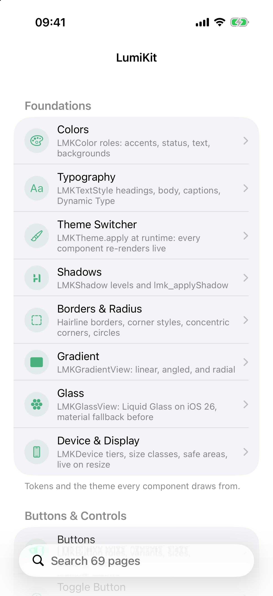
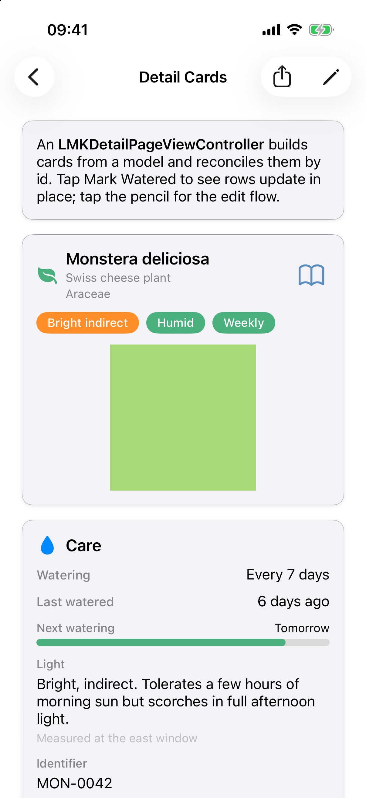
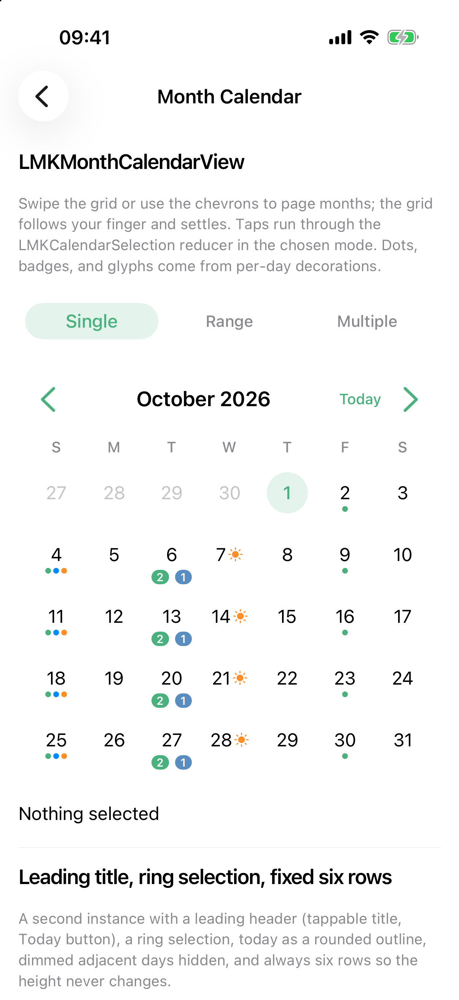
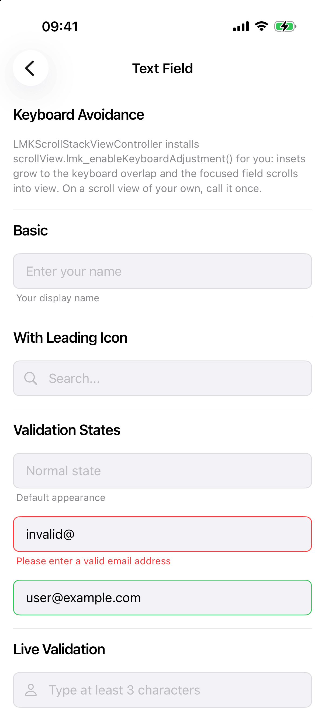

<p align="center">
  
</p>

# LumiKit

[](https://github.com/Luminoid/LumiKit/actions/workflows/ci.yml)
[](https://swiftpackageindex.com/Luminoid/LumiKit)
[](https://swiftpackageindex.com/Luminoid/LumiKit)
[](LICENSE)

A UIKit design system and component kit for iOS 18+, iPadOS, and Mac Catalyst, written in Swift 6.2: a value-type theme that re-renders live, a `Style` struct on every component, 60+ components and controls, a photo module, debug tooling, and Foundation utilities. Strings ship in English, Spanish, Simplified Chinese, and Traditional Chinese.

## Products

| Product | Depends on | What it holds |
|---|---|---|
| `LumiKitCore` | Foundation | `LMKLogger`, `LMKDate` and `LMKDateFormat`, `LMKFormat`, `LMKFile`, `LMKConcurrency`, `LMKURLValidator`, Gregorian calendar day and selection types, string and collection extensions |
| `LumiKitUI` | Core, SnapKit | Tokens and the theme, styles, components, controls, lists, navigation, calendar, detail cards, alerts, toasts, share sheet, haptics, animation, utilities, UIKit extensions |
| `LumiKitPhoto` | Core, UI | Photo browser, photo grid, crop editor, pick-and-crop coordinator, share preview, `LMKPhotoMetadata` |
| `LumiKitDebug` | Core, UI | `LMKNetworkLogger` (URLProtocol capture with redaction) and the request inspector; DEBUG builds only |
| `LumiKitLottie` | UI, Lottie | `LMKLottieRefreshControl` with its bundled ring animation |

Link `LumiKitPhoto` only where you show photos, and `LumiKitDebug` only in debug builds. `LumiKitUI` links `LumiKitCore` but does not re-export it: import `LumiKitCore` in files that name its types.

## Screenshots

| Catalog | Detail cards | Month calendar | Action sheet |
|---|---|---|---|
|  |  |  |  |

## Requirements

Swift 6.2 or later (Xcode 26 or Xcode 27), iOS 18 / Mac Catalyst 18 as the floor (`LumiKitCore` and `LumiKitDebug` also build for macOS 15). iOS 26 features (Liquid Glass, concentric corners, scroll-edge effects, tab bar minimize, and more) are adopted behind `#available` with same-API fallbacks, so callers never gate. Details in [docs/PLATFORM.md](docs/PLATFORM.md).

## Installation

```swift
dependencies: [
    .package(url: "https://github.com/Luminoid/LumiKit.git", from: "1.0.0"),
],
targets: [
    .target(name: "MyApp", dependencies: [
        .product(name: "LumiKitUI", package: "LumiKit"),
        .product(name: "LumiKitPhoto", package: "LumiKit"),   // optional
        .product(name: "LumiKitLottie", package: "LumiKit"),  // optional
    ]),
]
```

Upgrading from 0.x: read [docs/MIGRATION-1.0.md](docs/MIGRATION-1.0.md) and run `Scripts/migrate-1.0.sh <your-app> --dry-run`.

## Quick start

```swift
import LumiKitUI

// 1. A theme is a value. Override only what differs; apply it at launch or any time later.
extension LMKTheme {
    static let myApp = LMKTheme(colors: LMKColorTheme(primary: .systemIndigo, secondary: .systemTeal))
}
LMKTheme.apply(.myApp)

// 2. Tokens are dynamic: every LMKColor re-resolves on theme, dark mode, and contrast changes.
view.backgroundColor = LMKColor.backgroundPrimary
let title = UILabel.lmk_make(.h2, text: "Hello")

// 3. Components take a Style; nil fields fall back to the theme.
let save = LMKButton(title: "Save", style: .filled(.primary)) { print("saved") }
let chip = LMKChipView(text: "Outdoor", style: .outlined.tint(.systemGreen))
chip.onTap = { chip.isSelected.toggle() }

// 4. Presenters end in `present(from:)`; installed views end in `show(in:)`.
LMKToast.show(.success, "Saved", in: self)
LMKAlert.presentDeleteConfirmation(from: self, itemName: "Photo", onConfirm: { delete() })
```

App-wide defaults for any component live on the theme (`theme.button.variant = .tinted`), per-instance tweaks on `style`, and anything the Style does not cover in a `didApplyStyle` hook that re-runs on every theme change.

## Logging

`LMKLogger` (in `LumiKitCore`) writes through `os.Logger` under your app's subsystem.

```swift
import LumiKitCore

LMKLogger.configure(subsystem: Bundle.main.bundleIdentifier ?? "com.example.app")
LMKLogger.enableLogStore()                          // optional: an in-memory ring buffer for a debug screen
LMKLogger.entryHandler = { entry in breadcrumbs.add(entry) } // optional: forward every written entry

LMKLogger.notice("Sync finished: \(count) records", category: .data)
LMKLogger.error("Upload failed", private: fileURL.path, error: error, category: .network)
```

- **Six levels**, `debug < info < notice < warning < error < fault`, written at the unified-logging types `os.Logger`'s own methods use: `.debug`, `.info`, `.default`, `.error`, `.error`, `.fault`. Only notice and above are saved on the device, so a line you will need from a user's sysdiagnose is a notice or higher.
- **Runtime threshold.** `LMKLogger.minimumLevel` defaults to `.debug` in DEBUG builds and `.info` otherwise, and can change at any time. Nothing is compiled out. The threshold clamps at `.error`, so errors and faults are always written.
- **Public message, private detail.** The message is public: keep it to static text, codes, ids, counts, dimensions, and type names. Pass user data (URLs, file paths, user content, text shown to the user) as `private:`; it is written as private and redacted in field logs. `messagePrivacy = .private` additionally redacts the message text; the `[File.swift:12] function` prefix is always public.
- **Errors.** Attach them with `error:` instead of interpolating a description. `LMKLogger.describe(_:)` puts the type and case of a Swift enum error, or the NSError domain and code plus the underlying error's, in the public message as `[NSURLErrorDomain -1001 <- NSPOSIXErrorDomain 60]`, and the full description in the private detail.
- **Floods.** `LMKLogger.once(key, level, message)` writes a line once per key until `resetOnce(key)`, for failures on per-frame or polling paths.
- **Other packages' logs.** A package with its own logger can forward its entries into the app's store and handler with `LMKLogger.record(_:)`, which writes nothing to the unified log again and applies no threshold.
- **LumiKit's own lines** use the `LumiKit` category (`LMKLogger.LogCategory.lumiKit`): filter on it in Console or `log stream --predicate 'category == "LumiKit"'`. They reach the log store and the handler with no extra setup, and alerts, `LMKErrorHandler`, and `LMKConcurrency.executeTask` name your call site.

## Example app

`Example/` is a catalog of 68 pages in 12 sections (Foundations, Buttons & Controls, Text Input & Forms, Labels & Indicators, Cards & Lists, Dates, Navigation, Feedback & Status, Sheets & Panels, Photos & Media, Utilities, Debug), with search and a live theme switcher. Generate it with [XcodeGen](https://github.com/yonaskolb/XcodeGen):

```bash
cd Example && xcodegen generate && open LumiKitExample.xcodeproj
```

It doubles as the accessibility test bed: `-lmk-audit-all -lmk-config <name> -lmk-screenshots <dir>` walks every page, audits truncation, clipping, overlap, 44pt targets, labels, WCAG contrast, and fixed fonts, and writes a screenshot per page; `-lmk-rtl` and `-lmk-theme <name>` cover right-to-left and a second theme.

## Documentation

API reference on the Swift Package Index: [LumiKitCore](https://swiftpackageindex.com/Luminoid/LumiKit/documentation/lumikitcore), [LumiKitUI](https://swiftpackageindex.com/Luminoid/LumiKit/documentation/lumikitui), [LumiKitPhoto](https://swiftpackageindex.com/Luminoid/LumiKit/documentation/lumikitphoto), [LumiKitDebug](https://swiftpackageindex.com/Luminoid/LumiKit/documentation/lumikitdebug), [LumiKitLottie](https://swiftpackageindex.com/Luminoid/LumiKit/documentation/lumikitlottie). `make docs` builds the same archives locally. The `LumiKitUI` catalog carries the guides: Getting Started, Theming, Styling, Components, Controls, Extensions, Localization, Platform Support, and Migrating to 1.0.

## Build and test

```bash
brew bundle            # swiftlint, swiftformat, xcodegen
make setup-hooks       # pre-commit lint + format
make check             # SwiftLint --strict, SwiftFormat --lint
make build             # iOS Simulator          make build-catalyst   # Mac Catalyst
make test              # iOS Simulator          make test-filter FILTER=LumiKitUITests/LMKButtonTests
make example           # regenerate + build     make example-catalyst # the Example for the Mac idiom
make docs              # DocC archives
make migrate CONSUMER=../MyApp ARGS=--dry-run
```

UIKit targets need the simulator; `make build-host` builds `LumiKitCore` and `LumiKitDebug` natively on macOS. CI runs the same steps with warnings as errors, testing under Xcode 26 and Xcode 27.

## Naming

Public types carry the `LMK` prefix; extension members on UIKit and Foundation types carry `lmk_`. Namespaces are subject nouns (`LMKAnimation`, `LMKImage`, `LMKAlert`), view controllers end in `ViewController`, callbacks are present-tense `on<Event>` closures (`onValueChange` for a value), presenters use `present(from:)` and `show(in:)`, every component has a nested `Style` and `Strings`. The full rule set is in [CONTRIBUTING.md](CONTRIBUTING.md).

## Built with LumiKit

| App | Description |
|---|---|
| [Plantfolio Plus](https://plantfolio.luminoid.dev) | Plant care, watering schedules, collections, and photos for iOS, iPadOS, and Mac |
| [Petfolio](https://petfolio.luminoid.dev) | Pet care, health tracking, vet visits, food inventory for iOS, iPadOS, and Mac |
| [TripDays](https://tripdays.luminoid.dev) | Collaborative travel planner: day-by-day itineraries, maps, shared trips over iCloud, and expense splitting for iOS, iPadOS, and Mac |
| [Metamer](https://metamer.luminoid.dev) | Color-vision camera for iOS: CVD simulation, daltonize filters, true-color naming, and an Ishihara plate generator |

## Related projects

- [Monolith](https://github.com/Luminoid/Monolith): CLI that scaffolds iOS apps, Swift Packages, and Swift CLIs, with LumiKit wiring built in
- Everything else at [luminoid.dev](https://luminoid.dev)

## License and changelog

MIT, see [LICENSE](LICENSE). Release history in [CHANGELOG.md](CHANGELOG.md); security policy in [SECURITY.md](SECURITY.md).
